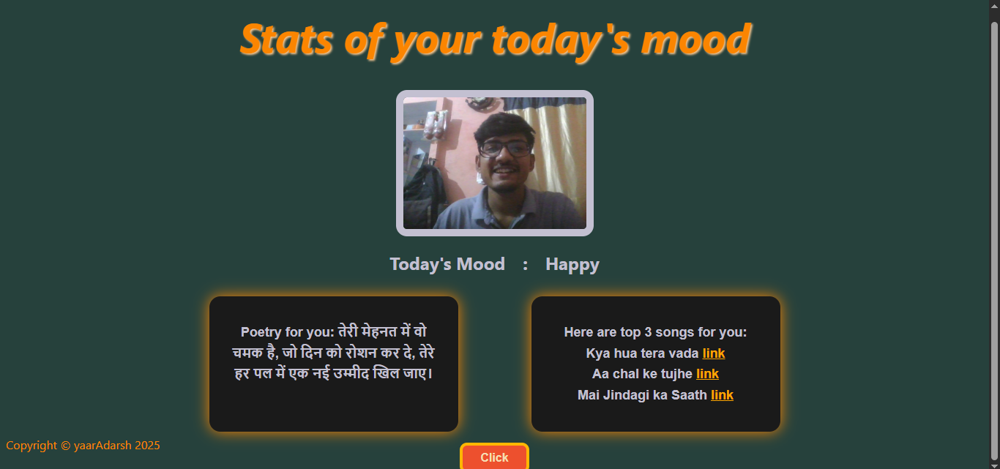
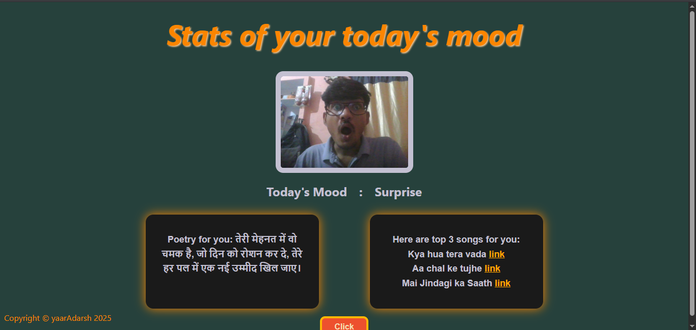

# Facial Mood Detection Attendance Taking Web App

This project is an Attendance Taking App with Facial Mood Detection, powered by Flask to generate a model API. 
It enhances the attendance experience by dynamically selecting music tracks and poetry based on the user's detected mood through facial expressions.

## Frontend & Backend
- Frontend is made using Bootstraps and custom HTML, CSS & JavaScript. It's both user friendly and user interactive.
It also guides how to take attendance through this web app and demontrates features of this website.
- Backend uses Node.js, Express.js, RESTful APIs and EJS fro rendering the results on webpage.

## Model Concept Overview
The Facial Mood Detection Machine Learning Model utilizes a Convolutional Neural Network (CNN) architecture trained on a dataset of labeled facial expressions. The model's objective is to classify the emotional states of individuals based on their facial features. The key steps involved in the model concept are as follows:

- **Data Collection:** The model is trained on a diverse dataset of facial images depicting various emotional states, including happiness, sadness, anger, fear, surprise, and disgust. These images are collected from publicly available datasets and may undergo preprocessing steps such as resizing and normalization.
  
- **Model Architecture:** The CNN architecture comprises multiple layers of convolutional, pooling, and fully connected layers. These layers are designed to extract hierarchical features from the input images, capturing both low-level and high-level patterns associated with different emotions.
  
- **Training Process:** The model is trained using the collected dataset through an iterative optimization process. During training, the model learns to minimize a predefined loss function by adjusting its parameters (weights and biases) through backpropagation. The optimization algorithm, such as stochastic gradient descent (SGD) or Adam, updates the parameters to improve the model's performance in classifying emotions.
  
- **Evaluation and Validation:** After training, the model's performance is evaluated using a separate validation dataset to assess its accuracy, precision, recall, and other performance metrics. The validation process helps ensure that the model generalizes well to unseen data and is not overfitting to the training data.
  
- **Deployment:** Once trained and validated, the model is deployed as part of the Attendance App backend. It serves as the core component responsible for detecting users' facial expressions in real-time and inferring their emotional states.

## Model Architecture Summary
The CNN architecture used for facial mood detection comprises the following layers:

- Convolutional Layers: Extract features from input images through convolution operations.
  
- Max Pooling Layers: Downsample feature maps to reduce spatial dimensions and extract dominant features.
  
- Batch Normalization Layers: Normalize activations to improve training stability and accelerate convergence.
  
- Dropout Layers: Regularize the model by randomly dropping units during training to prevent overfitting.
  
- Dense Layers: Perform classification based on learned features, with the final layer producing probabilities for each emotion class.
The summary of the model architecture, including the output shape and parameter count for each layer, is provided in the table below:

Layer (type)                    | Output Shape           | Param #
------------------------------- | ---------------------- | -------
conv2d_1 (Conv2D)               | (None, 48, 48, 32)     | 320
conv2d_2 (Conv2D)               | (None, 48, 48, 64)     | 18,496
batch_normalization             | (None, 48, 48, 64)     | 256
max_pooling2d_1 (MaxPooling2D)  | (None, 24, 24, 64)     | 0
dropout (Dropout)               | (None, 24, 24, 64)     | 0
conv2d_3 (Conv2D)               | (None, 24, 24, 128)    | 73,856
conv2d_4 (Conv2D)               | (None, 22, 22, 256)    | 295,168
batch_normalization_1           | (None, 22, 22, 256)    | 1,024
max_pooling2d_2 (MaxPooling2D)  | (None, 11, 11, 256)    | 0
dropout_1 (Dropout)             | (None, 11, 11, 256)    | 0
flatten_1 (Flatten)             | (None, 30976)          | 0
dense_2 (Dense)                 | (None, 1024)           | 31,720,448
dropout_2 (Dropout)             | (None, 1024)           | 0
dense_3 (Dense)                 | (None, 7)              | 7,175


## Server Directory Structure
- pycache: Contains compiled Python bytecode files.
- static: Directory for storing static files such as images and CSS.
- app.py: Flask application file containing the backend logic.
- haarcascade_frontalface_default.xml: Haarcascade XML file for facial detection.
- model.h5: Pre-trained Keras model file for emotion detection.
- requirements.txt: File listing Python dependencies required for running the Flask server.

## Usage
1. Navigate to the server directory:
   ```
   cd SentimentalAttendaceSystem/server
   ```
2. Install dependencies:
   ```
   pip install -r requirements.txt
   ```
3. Run the Flask application:
   (Before running change the "load model" path directory(18th line) in app.py for "model.h5" file according to your local path)
   ```
   python app.py
   ```
4. Now navigate to the AttendancePortal directory:
   ```
   cd  SentimentalAttendanceSystem/AttendancePortal
   ```
5. Install all required node dependencies (given in package.json):
   ```
   npm i
   ```
6. Run the backend application:
   ```
   node index.js
   ```
7. Now open index.html in the frontend directory to use the Sentimental Attendance Taking WebApp with Facial Mood Detection.
- For proper working of WebApp both server and backend should be running. 

## Features
- Facial Mood Detection: Detects user's emotions through facial expressions in real-time.
- Music Recommendation: Recommends music tracks based on the detected mood.
- Poetry Recommendation: Recommends poetry based on the detected mood.
- API Endpoint: Provides a Flask API endpoint for integrating the model with other applications.
- Privacy: Ensures compliance with privacy regulations and ethical standards related to facial recognition technology.

## Screenshots

- Results:







- Frontend:


## Contributing
Contributions are welcome! Please open an issue or submit a pull request with any improvements or features you'd like to add.
